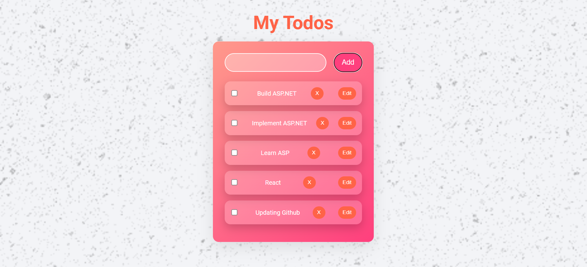
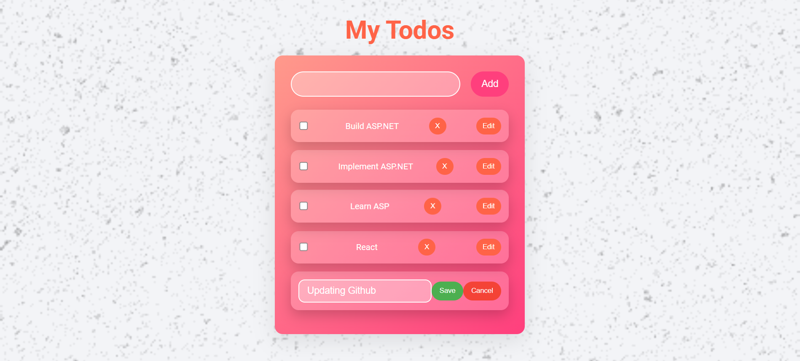

This is a simple TODO LIST web application and is done using ASP.NET(Backend API) and React (Frontend). It Includes all the CRUD operations both on backend and frontend. The backend is extensively designed with Microsoft EF and SQL Server.

##Adding a Todo

##Successfully added

##Editing a Todo

##Successfully Edited

##Deleting a Todo
